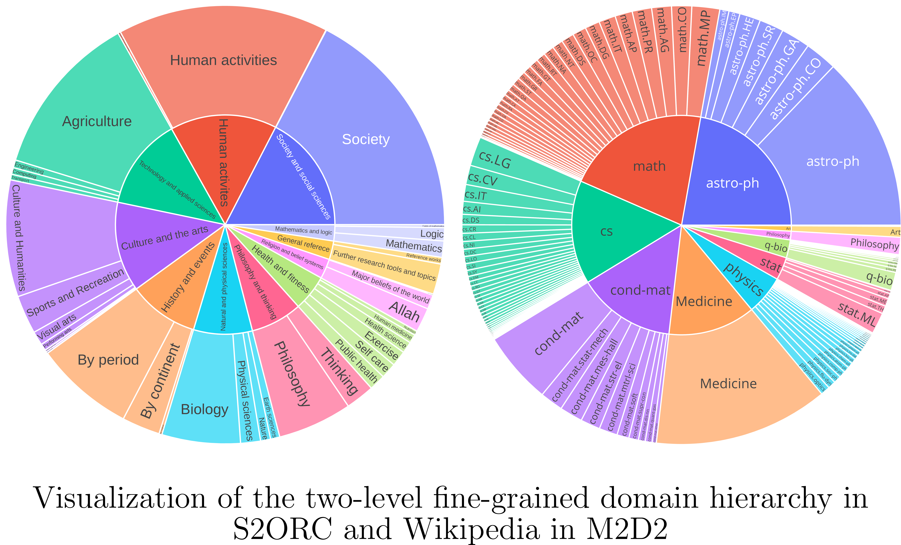

# M2D2: A Massively Multi-domain Language Modeling Dataset



## Data
Update: The data is currently hosted on HuggingFace [here](https://huggingface.co/datasets/machelreid/m2d2)!

To load the dataset use the following steps:
```bash
pip install --upgrade datasets
```
```python
import datasets

dataset = datasets.load_dataset("machelreid/m2d2", "cs.CL") # replace cs.CL with the domain of your choice

### Evaluation Sets


or via [`gdown`](https://pypi.org/project/gdown/):
```bash
#!/bin/bash
# install and/or upgrade gdown with pip
pip install --upgrade gdown
# Download M2D2 test sets
gdown "1U5wki_V-IFQy733HC6NO5ZuM2jaOaw8y"
# M2D2: A Massively Multi-domain Language Modeling Dataset


## Data
Update: The data is currently hosted on HuggingFace [here](https://huggingface.co/datasets/machelreid/m2d2)!

To load the dataset use the following steps:
```bash
pip install --upgrade datasets
```
```python
import datasets

dataset = datasets.load_dataset("machelreid/m2d2", "cs.CL") # replace cs.CL with the domain of your choice

### Evaluation Sets


# M2D2: A Massively Multi-domain Language Modeling Dataset


## Data
Update: The data is currently hosted on HuggingFace [here](https://huggingface.co/datasets/machelreid/m2d2)!

To load the dataset use the following steps:
```bash
pip install --upgrade datasets
```
```python
import datasets

dataset = datasets.load_dataset("machelreid/m2d2", "cs.CL") # replace cs.CL with the domain of your choice

### Evaluation Sets


or via [`gdown`](https://pypi.org/project/gdown/):
```bash
#!/bin/bash
# install and/or upgrade gdown with pip
pip install --upgrade gdown
# Download M2D2 test sets
gdown "1U5wki_V-IFQy733HC6NO5ZuM2jaOaw8y"
tar -xvzf m2d2_test_sets.tar.gz
# File structure
# m2d2_test_sets/
# ├─ DOMAIN_AA/
# │  ├─ test.txt
# ├─ DOMAIN_AB/
# │  ├─ test.txt/
```

## Fine-tune GPT-2 with/without BitFit

To run fine-tune:
```
. lm_scripts/adapt.sh
```

addtional arguments for bias term fine-tuning and shallow networks:
`--do_bitfit` (`bool`, _optional_, defaults to `False`) — Whether to train bias terms only or not. It is identical to BitFit training.
`--num_hidden_layers` (int, optional, defaults to -1) - If If set to a positive number, the  number of attention layers to perform. 


## Evaluation over multiple files

To evaluate model on one or multiple files:
provides a file with paths to evaluation files (one path one line)  to `--list_of_valid_paths` and run:

```
. lm_scripts/eval.sh
```


## Reproduction Scripts for Modeling

Find scripts for finetuning language models in `lm_scripts/adapt.sh`. Furthermore, we provide meta-scripts for generating scripts for multiple domains given an input file containing a list of directories containing domain specfici data (within `train.txt` and `valid.txt` should exist): `lm_scripts/generate_multiple.sh`. Respective instructions/parameters are included in each file.

For validation on multiple files, we also include `lm_scripts/validate_on_multiple_files.py` for calculating perplexity measures given a file containing a list of evaluation text files and a model checkpoint.

## Helper Scripts for Wikipedia Data Collection
For Wikipedia data collection, we include scripts for data dump processing (`data_scripts/wiki/get_data`), ontology gathering (`data_scripts/wiki/ontology`), and generating splits (`data_scripts/wiki/split_generation`).

## Helper Scripts for S2ORC Data Collection

*To be uploaded with documentation*

## Scripts to reproduce analyses in the paper

*To be uploaded with documentation*
